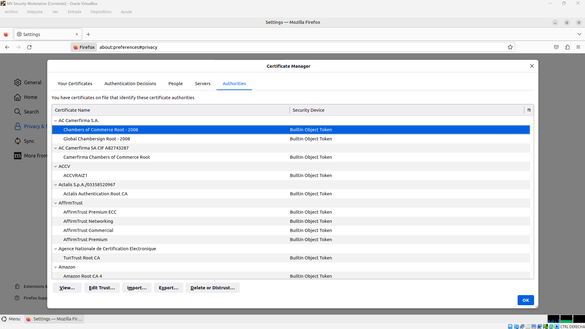
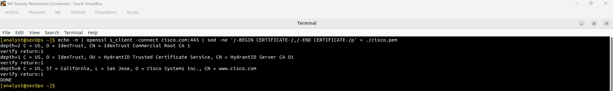
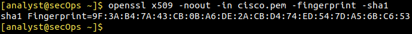

# Laboratorio: Almacenes de Entidades de Certificación y Detección de MitM

## 📋 Descripción General
Este laboratorio documenta la auditoría práctica de los almacenes de confianza de Autoridades de Certificación (CA) y el uso de criptografía de red para detectar posibles ataques de intermediario (*Man-In-the-Middle* / Proxy HTTPS). La práctica se llevó a cabo utilizando un entorno controlado de Linux (*Security Workstation*) y herramientas de línea de comandos para la inspección forense de certificados digitales.

---

## 🎯 Objetivos
* **Auditoría de Endpoints:** Inspeccionar los almacenes de Autoridades de Certificación raíz en navegadores web (Mozilla Firefox).
* **Análisis de Red (Live Triage):** Establecer conexiones TLS de bajo nivel para extraer cadenas de certificados directamente desde la capa de transporte (puerto 443).
* **Threat Hunting e Integridad:** Calcular y verificar huellas digitales criptográficas (*fingerprints*) mediante OpenSSL para detectar alteraciones o suplantaciones de identidad en las conexiones HTTPS.

---

## 🛠️ Tecnologías y Herramientas Utilizadas
* **Sistema Operativo:** Linux (*Security Workstation* / Entorno virtualizado).
* **Navegador Web:** Mozilla Firefox (*Certificate Manager*).
* **Protocolos:** TLS / HTTPS (Puerto TCP 443).
* **Herramientas de Línea de Comandos:** `OpenSSL`, `sed`, `echo`.

---

## 🚀 Desarrollo del Laboratorio

### Fase 1: Auditoría del Almacén de Certificados en Firefox (Endpoint Forensics)
Como analista de seguridad, el primer paso en la investigación de equipos es auditar en qué entidades confía el sistema. Si un atacante o una política oculta inyecta una CA maliciosa o un proxy corporativo no autorizado en el almacén de confianza, el navegador validará como legítimo cualquier certificado falso.

* **Procedimiento:** Se accedió al administrador de certificados de Firefox a través de las opciones de Privacidad y Seguridad, inspeccionando el listado global de autoridades raíz instaladas en el sistema.


*Figura 1: Vista del Administrador de Certificados en Mozilla Firefox mostrando las Autoridades de Certificación (CA) de confianza.*

---

### Fase 2: Extracción de Certificados y Detección de MitM con OpenSSL (Threat Hunting)
Para evitar depender exclusivamente de interfaces gráficas que podrían estar comprometidas, realizamos una extracción directa del certificado del servidor remoto (`cisco.com`) a nivel de transporte.

#### 1. Extracción Cruda del Certificado TLS
Se ejecutó un pipeline de comandos para negociar una sesión TLS con el servidor en el puerto 443, aislar el bloque de certificado PEM y almacenarlo localmente:

```bash
echo -n | openssl s_client -connect cisco.com:443 | sed -ne '/-BEGIN CERTIFICATE-/,/-END CERTIFICATE-/p' > ./cisco.pem
```

* **Explicación técnica:** 
  * `openssl s_client -connect cisco.com:443`: Fuerza una conexión y un handshake TLS crudo con el servidor de destino.
  * `sed -ne ...`: Filtra únicamente el bloque comprendido entre los delimitadores `BEGIN CERTIFICATE` y `END CERTIFICATE`.
  * `> ./cisco.pem`: Guarda la evidencia forense limpia en un archivo de texto plano para su posterior análisis.


*Figura 2: Terminal de Linux mostrando la cadena de certificación obtenida (Depth 2, 1 y 0) y el cierre exitoso de la conexión.*

---

#### 2. Cálculo de la Huella Digital (Fingerprint SHA-1)
Una vez obtenido el archivo `cisco.pem`, se generó un resumen hash criptográfico unidireccional para comprobar la integridad del certificado:

```bash
openssl x509 -noout -in cisco.pem -fingerprint -sha1
```

* **Explicación técnica:** El comando procesa el certificado X.509 utilizando el algoritmo de resumen SHA-1 para arrojar una huella dactilar hexadecimal única. 
* **Perspectiva de Ciberseguridad:** Si un atacante o proxy malicioso intercepta la red (*Man-in-the-Middle*) y modifica el certificado para inspeccionar el tráfico cifrado, el hash resultante cambiará por completo respecto al baseline legítimo, alertando de inmediato al analista SOC.


*Figura 3: Salida de la terminal mostrando el SHA1 Fingerprint generado del certificado extraído.*

---

## ✅ Verificaciones Realizadas
1. Se confirmó visualmente el árbol de confianza en el navegador Firefox sin la presencia de anomalías o CAs no autorizadas.
2. Se completó con éxito el enlace TLS con un servidor de producción externo mediante la herramienta OpenSSL.
3. Se obtuvo y verificó con éxito el hash criptográfico del certificado para asegurar la integridad de la comunicación.

---

## 💡 Conceptos Aprendidos
* **Autoridad de Certificación (CA):** Entidad responsable de emitir y validar la autenticidad de los certificados digitales en la infraestructura de clave pública (PKI).
* **Ataque de Intermediario (MitM):** Riesgo asociado a la inserción no autorizada de CAs en los almacenes de confianza de los dispositivos.
* **Funciones Hash en Ciberseguridad:** Uso de algoritmos de resumen para la detección rápida de modificaciones o manipulaciones en archivos y certificados.

---

## 🚀 Conclusión
Este laboratorio permitió afianzar habilidades clave de análisis forense en terminal y validación de protocolos seguros. Comprender cómo operan los certificados por debajo de la interfaz gráfica es fundamental para un analista de ciberseguridad enfocado en la detección temprana de amenazas en redes e infraestructura.
